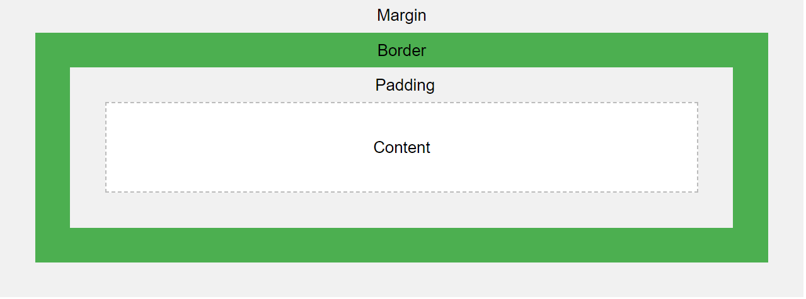

# Quick Links:

- [CSS](https://github.com/a-chakrawarti/Webpage-Crownstack/tree/master/handbook#css-cascading-style-sheets)

# !FAQ

- [Difference between display: none; vs visibility: hidden;](https://github.com/a-chakrawarti/Webpage-Crownstack/tree/master/handbook#difference-display-none-vs-visibility-hidden)

# HTML (Hyper Text Markup Language) 

- `<!DOCTYPE>` declaration represents the document type and `<!DOCTYPE html>` is declaration for HTML5.
- The `<html>` element is the root element and it defines the whole HTML document.

## >| The `<head>` Element
- The HTML `<head>` element is a container for the following elements: `<title>`, `<style>`, `<meta>`, `<link>`, `<script>`, and `<base>`.

- The `<meta>` element is typically used to specify the character set, page description, keywords, author of the document, and viewport settings.
The metadata will not be displayed on the page, but are used by browsers (how to display content or reload page), by search engines (keywords), and other web services.

- Define the character set used: `<meta charset="UTF-8">`
- Define keywords for search engines: `<meta name="keywords" content="HTML, CSS, JavaScript">`
- Define a description of your web page: `<meta name="description" content="Free Web tutorials">`
- Define the author of a page: `<meta name="author" content="John Doe">`
- Refresh document every 30 seconds: `<meta http-equiv="refresh" content="30">`

- Setting the viewport to make your website look good on all devices: `<meta name="viewport" content="width=device-width, initial-scale=1.0">`
    - This gives the browser instructions on how to control the page's dimensions and scaling.
    - The `width=device-width` part sets the width of the page to follow the screen-width of the device (which will vary depending on the device).
    - The `initial-scale=1.0` part sets the initial zoom level when the page is first loaded by the browser.
- The `<base>` element specifies the base URL and/or target for all relative URLs in a page.
The `<base>` tag must have either an href or a target attribute present, or both.There can only be one single `<base>` element in a document!

- The `<body>` element defines the document's body.
- The `<br>` tag defines a line break, and is an empty element without a closing tag.
- The `<a>` tag defines a hyperlink. The `href` attribute specifies the URL of the page the link goes to. Example: `<a href="https://www.w3schools.com">Visit W3Schools</a>`
    - The target attribute specifies where to open the linked document.

    - The target attribute can have one of the following values:

      1. _self - Default. Opens the document in the same window/tab as it was clicked
      2. _blank - Opens the document in a new window or tab
      3. _parent - Opens the document in the parent frame
      4. _top - Opens the document in the full body of the window

- Use `mailto:` inside the href attribute to create a link that opens the user's email program. Example: `<a href="mailto:someone@example.com">Send email</a>`

- The `` tag is used to embed an image in an HTML page. The `src` attribute specifies the path to the image to be displayed. Two ways to specific URL in `src` attribute.
  1. Absolute URL - Links to an external image that is hosted on another website. Example: `src="https://www.w3schools.com/images/img_girl.jpg"`
  2. Relative URL - Links to an image that is hosted within the website. Example: `src="/images/img_girl.jpg"`
  - The value of the `alt` attribute should describe the image. If a browser cannot find an image, it will display the value of the `alt` attribute.
  - We can use `style` attribute to specify the width and height of an image or alternatively we can use `width` and `height` attributes.

  > It is almost always best to use relative URLs. They will not break if you change domain.

- To use an image as a link, just put the `` tag inside the `<a>` tag.

- The `style` attribute is used to add styles to an element, such as color, font, size, and more. Example: `<p style="color:red;">This is a red paragraph.</p>`

- `<html lang="en">` is meant to assist search engines and browsers. `<html lang="en-US">` country codes can also be added to the language code.

- The `title` attribute defines some extra information about an element.

    The value of the title attribute will be displayed as a tooltip when you mouse over the element. Example: `<p title="I'm a tooltip">This is a paragraph.</p>`

- Search engines use the headings to index the structure and content of your web pages.

    Users often skim a page by its headings. It is important to use headings to show the document structure.

- The `<hr>` tag defines a thematic break in an HTML page, and is most often displayed as a horizontal rule. The `<hr>` tag is an empty tag, which means that it has no end tag.

- The HTML `<pre>` element defines preformatted text. The text inside the element is displayed in a fixed-width font (usually Courier), and it preserves both spaces and line breaks.

- The HTML `<strong>` element defines text with strong importance. The content inside is typically displayed in bold.

- The HTML `<small>` element defines smaller text.

- The HTML `<mark>` element defines text that should be marked or highlighted.

- The HTML `<del>` element defines text that has been deleted from a document. Browsers will usually strike a line through deleted text.

- The HTML `<ins>` element defines a text that has been inserted into a document. Browsers will usually underline inserted text.

- The HTML `<sub>` element defines subscript text. Subscript text appears half a character below the normal line, and is sometimes rendered in a smaller font. Subscript text can be used for chemical formulas.

- The HTML `<sup>` element defines superscript text. Superscript text appears half a character above the normal line, and is sometimes rendered in a smaller font.

- The HTML `<blockquote>` element defines a section that is quoted from another source.
Browsers usually indent `<blockquote>` elements.

- The HTML `<q>` tag defines a short quotation. Browsers normally insert quotation marks around the quotation.

- The HTML `<abbr>` tag defines an abbreviation or an acronym. Use the global `title` attribute to show the description for the abbreviation/acronym when you mouse over the element.

- The HTML `<address>` tag defines the contact information for the author/owner of a document or an article.

- The HTML `<cite>` tag defines the title of a creative work. The text in the `<cite>` element usually renders in italic. A person's name is not the title of a work.

- The HTML `<bdo>` tag is used to override the current text direction. BDO stands for Bi-Directional Override. Example: `<bdo dir="rtl">This text will be written from right to left</bdo>`

- In HTML, a color can be specified using hue, saturation, and lightness (HSL) in the form.

- Bookmarks can be useful if a web page is very long.
To create a bookmark - first create the bookmark, then add a link to it.
When the link is clicked, the page will scroll down or up to the location with the bookmark. 

    ```html
        <h2 id="C4">Chapter 4</h2>
        <a href="#C4">Jump to Chapter 4</a>

        // You can also add a link to a bookmark on another page
        <a href="html_demo.html#C4">Jump to Chapter 4</a>
    ```

- HTML also supports description lists. 
    ```html
    <dl> <!-- description list --> 
    <dt>Coffee</dt> <!-- description term -->
    <dd>- black hot drink</dd> <!-- description describe -->
    <dt>Milk</dt> 
    <dd>- white cold drink</dd>
    </dl>
    ```

- The CSS `list-style-type` property is used to define the style of the list item marker. It can have one of the following values.
  - disc: sets the item marker to a bullet(default)
  - circle: sets the list item marker to a circle
  - square: sets the list item marker to a square
  - none: items will not be marked

- An ordered list starts with the `<ol>` tag. Each list item starts with the `<li>` tag.
- The `type` attribute of the `<ol>` tag, defines the type of the list item marker.
- Example: type = {1, A, a, I, i}
    ```html
    <ol type="1">
    <li>Coffee</li>
    <li>Tea</li>
    <li>Milk</li>
    </ol>
    ```
- By default, an ordered list will start counting from 1. If you want to start counting from a specified number, you can use the `start` attribute.
- Example:
    ```html
    <ol start="50">
    <li>Coffee</li>
    <li>Tea</li>
    <li>Milk</li>
    </ol>
    ```

- The `<map>` tag is used to define an image map. An image map is an image with clickable areas.

## >| `class` and `id` Attributes

- HTML elements can belong to more than one class.

    > To define multiple classes, separate the class names with a space, e.g. `<div class="city main">`. The element will be styled according to all the classes specified

 - The `id` attribute specifies a unique id for an HTML element. The value of the id attribute must be unique within the HTML document.

 - A class name can be used by multiple HTML elements, while an id name must only be used by one HTML element within the page

## >| Block-level Elements
- A block-level element always starts on a new line.
- A block-level element always takes up the full width available (stretches out to the left and right as far as it can).
- A block level element has a top and a bottom margin, whereas an inline element does not.
- Examples: `<div>`, `<nav>`, `<main>`, `<section>`, `<header>`, `<h1-h6>` etc
- The `<div>` element is often used as a container for other HTML elements.

## >| Inline Elements
- An inline element does not start on a new line.

- An inline element only takes up as much width as necessary.

- This is a `<span>` element inside a paragraph.
- Examples: `<a>`, `<button>`, `<small>`, `<strong>`, `<input>` etc
- The `<span>` element is an inline container used to mark up a part of a text, or a part of a document.

## >| HTML Iframes
- An HTML iframe is used to display a web page within a web page

- Example: `<iframe src="url" title="description">`


- The HTML `<noscript>` tag defines an alternate content to be displayed to users that have disabled scripts in their browser or have a browser that doesn't support client-side scripts.
- Example: 
    ```html
    <script>
    document.getElementById("demo").innerHTML = "Hello JavaScript!";
    </script>
    <noscript>Sorry, your browser does not support JavaScript!</noscript>
    ```

## >| HTML Layout
There are four different techniques to create multicolumn layouts
- CSS framework : Create fast layout leverging prebuild framworks like [W3.CSS](https://www.w3schools.com/w3css/default.asp) or [Bootstrap](https://www.w3schools.com/bootstrap/default.asp).
- CSS float property : Entire web layout using CSS `float` and `clear` property. [Click here to read more!](https://www.w3schools.com/css/css_float.asp)
- [CSS flexbox](https://www.w3schools.com/css/css3_flexbox.asp) : ensures that elements behave predictably when the page layout must accommodate different screen sizes and different display devices.
- [CSS grid](https://www.w3schools.com/css/css_rwd_grid.asp) : CSS Grid Layout Module offers a grid-based layout system, with rows and columns, making it easier to design web pages without having to use floats and positioning.

## >| HTML Responsive
- Use of `<meta name="viewport" content="width=device-width, initial-scale=1.0">` makes website responsive.
- Responsive Image: `` the image can be scaled up to be larger than its original size but a better solution would be to use `max-width: 100%`, Example: ``.
- Use of `<picture>` to show different images depending on browser width.
- Responsive Text Size: Example: `<h1 style="font-size:10vw">Hello World</h1>`, "vw" unit means "wiewport width", this way the text size will follow the size of the browser window.
    > Viewport is the browser window size. 1vw = 1% of viewport width. If the viewport is 50cm wide, 1vw is 0.5cm.
- Media Queries: [Click here to read more!](https://www.w3schools.com/css/css_rwd_intro.asp)

## >| HTML ComputerCode

- The `<kbd>` element defines keyboard input: Monospace
- The `<samp>` element defines sample output from a computer program : Monospace
- The `<code>` element defines a piece of computer code : Monospace
- The `<var>` element defines a variable in programming or in a mathematical expression : Italics
- The `<pre>` element defines preformatted text : Maintains whitespace

## >| HTML Forms

- Notes on GET:

    - Appends the form data to the URL, in name/value pairs
    - NEVER use GET to send sensitive data! (the submitted form data is visible in the URL!)
    - The length of a URL is limited (2048 characters)
    - Useful for form submissions where a user wants to bookmark the result
    - GET is good for non-secure data, like query strings in Google

- Notes on POST:

    - Appends the form data inside the body of the HTTP request (the submitted form data is not shown in the URL)
    - POST has no size limitations, and can be used to send large amounts of data.
    - Form submissions with POST cannot be bookmarked

- The `autocomplete` attribute specifies whether a form should have autocomplete on or off.

    - When autocomplete is on, the browser automatically complete values based on values that the user has entered before.
    - Example: `<form action="/action_page.php" autocomplete="on">`

- The `<select>` element defines a drop-down list
    - Example: 
    ```html
    <label for="cars">Choose a car:</label>
    <select id="cars" name="cars" size="3" multiple> <!-- size attribute to specify the number of visible values | multiple attribute to allow the user to select more than one value (hold ctrl while selecting)-->
    <option value="volvo">Volvo</option>
    <option value="saab" selected>Saab</option> <!-- saab is pre-selected -->
    <option value="fiat">Fiat</option>
    <option value="audi">Audi</option>
    </select>
    ```
- `<textarea>` element defines a multi-line input field (a text area)
    - Example: 
    ```html
    <textarea name="message" rows="10" cols="30">
    The cat was playing in the garden.
    </textarea>
    ```
- `<button>` element defines a clickable button.Example:
   ```html
   <button type="button" onclick="alert('Hello World!')">Click Me!</button>
   ```
- [Different Input Types](https://www.w3schools.com/html/html_form_input_types.asp)

## >| HTTP Messages
- `1xx`: Information - Request received, continuing process 
- `2xx`: Successful - The action was successfully received, understood, and accepted
- `3xx`: Redirection - Further action must be taken in order to complete the request
- `4xx`: Client Error - The request contains bad syntax or cannot be fulfilled
- `5xx`: Server Error - The server failed to fulfill an apparently valid request
  > Learn more [click here](https://www.w3schools.com/tags/ref_httpmessages.asp)

## >| Miscellaneous
- [HTML Global Atrributes](https://www.w3schools.com/tags/ref_standardattributes.asp)
- [Global Event Attributes](https://www.w3schools.com/tags/ref_eventattributes.asp)
- [HTML Element Reference](https://www.w3schools.com/tags/default.asp)
- [HTML Entities](https://www.w3schools.com/html/html_entities.asp)

# **CSS (Cascading Style Sheets)**

- Multiple CSS declarations are separated with semicolons, and declaration blocks are surrounded by curly braces.
    ```css
    selector {
        /* declaration */
        property1: property-value;
    }
    ```

## _**>| Box Model**_


- The CSS `margin` properties are used to create space around elements, outside of any defined borders. Negative values are allowed.
- If the `margin` property has two values, for Example, `margin: 20px 30px;` 20px will apply to top, bottom and 30px to right and left.
- The CSS `padding` properties are used to generate space around an element's content, inside of any defined borders. Negative values are not allowed.
- Adding padding to the width and height will increase the total width and height of an element. For example:
  ```css
  element {
      width: 100px;
      height: 200px;
      padding: 20px;
  }
  ```
  ### Box-Sizing

  Here the total width will be 140px and height will be 240px. To tackle this we would use `box-sizing` property which will keep the size of the element fixed
  but will decrease the content space inside the element.

- The box-sizing property allows us to include the padding and border in the box's total width (and height), making sure that the padding stays inside of the box and that it does not break.  
- Total element width = width + left padding + right padding + left border + right border + left margin + right margin

- An outline is a line that is drawn around elements, OUTSIDE the borders, to make the element "stand out".

### _Margin Collapse_
- Top and bottom margins of elements are sometimes collapsed into a single margin that is equal to the largest of the two margins. This does not happen on left and right margins! Only top and bottom margins!

## >| CSS Text
- `vertical-align` property sets the vertical alignment of an element. Values are top, middle and bottom. Only inline and table elements.
- `text-decoration` property has values none, overline, underline, line-through.
- `text-transform` property has uppercase, lowercase and capitalize values.
- `text-indent` property is used to specify the indentation of the first line of a text.
- `letter-spacing` property is used to specify the space between the characters in a text.
- `line-height` property is used to specify the space between lines. The default line height in most browsers is about 110% to 120%.
- `word-spacing` property is used to specify the space between the words in a text.
- `white-space` property specifies how white-space inside an element is handled.
- `text-shadow` property adds shadow to text. Usage:
    ```css
    h1 {
    text-shadow: 2px 2px 5px red;
    }
    ```
    - 2px, 2px: horizontal, vertical shadow
    - 5px: blur
    - color: red

- Difference between Serif and Sans-Serif fonts:

   - Serif fonts have a small stroke at the edges of each letter. They create a sense of formality and elegance.
   - Sans-serif fonts have clean lines (no small strokes attached). They create a modern and minimalistic look.
   - Monospace fonts - here all the letters have the same fixed width. They create a mechanical look. 
   - Cursive fonts imitate human handwriting.
   - Fantasy fonts are decorative/playful fonts.
- `font-family` property should hold several font names as a "fallback" system, to ensure maximum compatibility between browsers/operating systems. The font names should be separated with comma.
Usage: `font-family: "Times New Roman", Times, serif;`


## >| Max-width, Max-height & Min-width, Min-height
- max-width: if content larger than max-width, it will automatically change the height. Overrides width property.
- max-height: if cotent larger than max-height, it will overflow. Use the `overflow` property to handle the change.
- min-width: content smaller than min-width, min-width will be applied.
- min-height: content smaller, min-height applied. Prevents height property to become less than min-height.


## >| CSS Selectors
CSS selectors are used to "find" (or select) the HTML elements you want to style.

- Simple selectors (select elements based on name, id, class) [class and id cannot start with a number]
  - id(#), class(.), element.class(only specific HTML elements should be affected by a class)
  - HTML elements can also refer to more than one class. Example: `<p class="center large">This paragraph refers to two classes.</p>`
  - Elements having same style definitions can be grouped by separating each selector with a comma. Example:   `h1, h2, h3 {style definition}`

- Combinator selectors (select elements based on a specific relationship between them)
- Pseudo-class selectors (select elements based on a certain state)
- Pseudo-elements selectors (select and style a part of an element)
- Attribute selectors (select elements based on an attribute or attribute value)

## >| CSS Colors

HTML supports 140 standard color names.

Colors are specified using 140 color names or RGB (red, green, blue), HEX(#rrggbb), HSL (hue, saturation, lightness) values.
In RGBA and HSLA (A specifies the opacity for a color) The alpha parameter is a number between 0.0 (fully transparent) and 1.0 (not transparent at all).

- Shades of gray are often defined using equal values for all the 3 light sources.
- Hexadecimal (HEX) values between 00 and ff (same as decimal 0-255).
- HSL: Hue is a degree on the color wheel from 0 to 360. 0 is red, 120 is green, and 240 is blue.

    - Saturation is a percentage value, 0% means a shade of gray, and 100% is the full color.
    - Lightness is also a percentage, 0% is black, 50% is neither light or dark, 100% is white


- The `background-position` property is used to specify the position of the background image. Example: `background-position: right top;`
- The `background-attachment` property specifies whether the background image should scroll or be fixed (will not scroll with the rest of the page)
- The `background-clip` property defines how far the background (color or image) should extend within an element. Usage:`background-clip: border-box|padding-box|content-box|initial|inherit;`
- The `background-origin` property specifies the origin position (the background positioning area) of a background image.
- The `background-position` property sets the starting position of a background image.
- CSS can be added to HTML documents in 3 ways:

    - Inline - by using the style attribute inside HTML elements. Example: `<h1 style="color:blue;">A Blue Heading</h1>`
    - Internal - by using a `<style>` element in the `<head>` section
    ```html
    <!DOCTYPE html>
    <html>
    <head>
    <style>
    body {background-color: powderblue;}
    h1   {color: blue;}
    p    {color: red;}
    </style>
    </head>
    <body>

    <h1>This is a heading</h1>
    <p>This is a paragraph.</p>

    </body>
    </html>
    ```
    - External - by using a `<link>` element to link to an external CSS file. `<link rel="stylesheet" href="styles.css">`

- The CSS `padding` property defines a padding (space) between the text and the border.
- The CSS `margin` property defines a margin (space) outside the border

- `<span style="cursor: progress">progress</span><br>` thats how to add different cursors to different elements in a webpage.

- Use the CSS `float` property to let the image float to the right or to the left of a text.
- The `clear` property specifies what elements can float beside the cleared element and on which side.
- If an element is taller than the element containing it, and it is floated, it will overflow outside of its container. You can use the "clearfix" hack to fix this.

## >| CSS Display

`display` property specifies if/how an element is displayed. Most elements have a display value either `block` or `inline`.
- Block-Level elements: Starts on a new-line takes up full width, example: `<div>`, `<h1>-<h6>`, `<header>`, `<footer>`, `<form>` etc
- Inline elements: Doesn't start in a new-line and takes up width as necessary, example: `<span>`, `<a>`, `` etc
- `display: none;` is commonly used with JavaScript to hide and show elements without deleting and recreating them. Example: The `<script>` element uses none as default.

- Compared to `display: inline`, the major difference is that `display: inline-block` allows to set a width and height on the element.

- Also, with `display: inline-block`, the top and bottom margins/paddings are respected, but with `display: inline` they are not.

- Compared to `display: block`, the major difference is that `display: inline-block` does not add a line-break after the element, so the element can sit next to other elements.

### _Difference: `display: none;` vs `visibility: hidden;`_
- `display: none` : Hiding an element can be done by setting the display property to none. The element will be hidden, and the page will be displayed as if the element is not there
- `visibility:hidden;` : The element will still take up the same space as before. The element will be hidden, but still affect the layout

## >| CSS Layout: The position property
- The `position` property has 5 values using which an element can be positioned top, right, bottom and left. One cannot use the top, right, bottom and left property without specifying the position property of that element.

1. `position: static;` : default, not affected by TRBL properties.
2. `position: relative` : TRBL relative to its normal position. No auto adjust will take place by other element.
3. `position: fixed` : An element with position: fixed; is positioned relative to the viewport, which means it always stays in the same place even if the page is scrolled.
4. `position: absolute` : Positioned relative to the nearest positioned ancestor (instead of positioned relative to the viewport, like fixed). However; if an absolute positioned element has no positioned ancestors, it uses the document body, and moves along with page scrolling.
5. `position: sticky` : An element with position: sticky; is positioned based on the user's scroll position. A sticky element toggles between relative and fixed, depending on the scroll position. It is positioned relative until a given offset position is met in the viewport - then it "sticks" in place (like position:fixed).


> `position: relative` places an element relative to its current position without changing the layout around it, whereas `position: absolute` places an element relative to its parent’s position and changing the layout around it.

## >| CSS Overflow

The overflow property specifies whether to clip the content or to add scrollbars when the content of an element is too big to fit in the specified area.
The overflow property only works for block elements with a specified height.
- `overflow: visible;` : clipped, renders outside the box
- `overflow: hidden` : clipped, and the rest of the content is hidden
- `overflow: scroll` : clipped, adds a scroll bar inside the box
- `overflow: auto` : similar to `scroll` value, adds scrolls whenever necessary.
- `overflow-x` and `overflow-y` to how manage overflow of content in horizontally and vertically.

## >| CSS Combinators
A combinator is something that explains the relationship between the selectors.


There are four different combinators in CSS:

- descendant selector (space): matches all elements that are descendants of a specified element
  - Example: `div p {}` selects all `<p>` elements inside `<div>` elements
- child selector (>):  selects all elements that are the children of a specified element
  - Example: `div > p {}` selects all `<p>` elements that are children of a `<div>` element
- adjacent sibling selector (+): is used to select an element that is directly after another specific element. Sibling elements must have the same parent element.
  - Example: `div + p` selects the first `<p>` element that are placed immediately after `<div>` elements.
- general sibling selector (~): selects all elements that are siblings of a specified element
  - Example: `div ~ p` selects all `<p>` elements that are siblings of `<div>` elements.

Reference: https://developer.mozilla.org/en-US/docs/Learn/CSS/Building_blocks/Selectors/Combinators

## >| CSS Attribute Selectors
It is possible to style HTML elements that have specific attributes or attribute values.
- The `[attribute]` selector is used to select elements with a specified attribute.
   - Example: selects all `<a>` elements with a target attribute 
        ```css
        a[target] {
            background-color: yellow;
        }
        ```
- The `[attribute="value"]` selector is used to select elements with a specified attribute and value. Example `a[target="_blank"] {}`
- The `[attribute~="value"]` selector is used to select elements with an attribute value containing a specified word. Example: selects all elements with a title attribute that contains a space-separated list of words, one of which is "flower" `[title~="flower"]`

Reference: https://www.w3schools.com/css/css_attribute_selectors.asp


## >| CSS Pseudo-class
A pseudo-class is used to define a special state of an element
```css
selector:pseudo-class {
  property: value;
}
```
- Anchor Pseudo-class

- One can change the link state colors, by using CSS, A link can also be styled as a button, by using CSS.
   - a:link - a normal, unvisited link
   - a:visited - a link the user has visited
   - a:hover - a link when the user mouses over it
   - a:active - a link the moment it is clicked
   - When setting the style for several link states, there are some order rules:
      - a:hover MUST come after a:link and a:visited
      - a:active MUST come after a:hover

Reference: https://www.w3schools.com/css/css_pseudo_classes.asp

## >| CSS Pseudo-elements
A CSS pseudo-element is used to style specified parts of an element.

```css
selector::pseudo-element {
  property: value;
}
```
- The `::before` pseudo-element can be used to insert some content before the content of an element. Example: `h1::before {}`
- The `::after` pseudo-element can be used to insert some content after the content of an element. Example: `h1::after {}`
- The `::marker` pseudo-element selects the markers of list items. Example: `::marker {color: red;}`
- The `::selection` pseudo-element matches the portion of an element that is selected by a user. `::selection {color: blue; background-color: white;}`
   - The following CSS properties can be applied to `::selection`: `color`, `background`, `cursor`, and `outline`.

Reference: https://www.w3schools.com/css/css_pseudo_elements.asp


## >| Specificity
If there are two or more conflicting CSS rules that point to the same element, the browser follows some rules to determine which one is most specific and therefore wins out.
Think of specificity as a score/rank that determines which style declarations are ultimately applied to an element.
The universal selector (*) has low specificity, while ID selectors are highly specific.
1. Inline styles, i.e; style attribute - 1000
2. ID/each - 100
3. Class, Attribute and Pseudo-class (each) - 10
4. Elements(h1, p etc), pseudo-elements(::before etc) - 1

## >| Box Shadow

Reference : https://www.w3schools.com/css/css3_shadows_box.asp


Reference : https://developer.mozilla.org/en-US/docs/Web/CSS/box-shadow

## >| CSS 2D Transform
Allow to move, rotate, scale, and skew elements.
- The `transform` property can use the following 2D transformation methods.
   - translate(): moves an element from its current position, provided X and Y. Example: `transform: translate(50px, 100px);`, 50px right, 100px down.
   - rotate(): rotates an element clockwise or counter-clockwise according to a given degree. Example `transform: rotate(20deg);` clockwise, -ve value will rotate counter-clockwise.
   - scale(): increases or decreases the size of an element, provided W and H. Example: `transform: scale(2, 3);`, 2 times width, 3 times height.
      - scaleX(): increases or decreases the width of an element.
      - ScaleY(): increases or decreases the height of an element.
   - skew(): skews an element along the X and Y-axis by the given angles. Example: `transform: skew(20deg, 10deg);` 20deg along X-axis, 10deg along Y-axis.
      - skewX(): skews an element along the X-axis by the given angle. Example: `transform: skewX(20deg)`
      - skewY(): skews an element along the Y-axis by the given angle.
   - matrix(): combines all the 2D transform methods into one. The matrix() method take six parameters, containing mathematic functions, which allows you to rotate, scale, move (translate), and skew elements. Usage: `matrix(scaleX(),skewY(),skewX(),scaleY(),translateX(),translateY())`. Example: `transform: matrix(1, -0.3, 0, 1, 0, 0);`

## >| CSS Transitions

Reference: https://www.w3schools.com/css/css3_transitions.asp

## >| Miscellaneous
- [CSS Units](https://www.w3schools.com/cssref/css_units.asp)
- [Font Pairing](https://www.w3schools.com/css/css_font_pairings.asp)
- [CSS Navbar](https://www.w3schools.com/css/css_navbar.asp)
- [CSS Forms](https://www.w3schools.com/css/css_form.asp)


# Responsive Elements

## >| Table

```html
<div style="overflow-x:auto;">
    <table>
        ...
    </table>
</div>
```

# Sites to look into:
- [CSS Tricks](https://css-tricks.com/)
- [HTML: w3Schools](https://www.w3schools.com/html/default.asp)